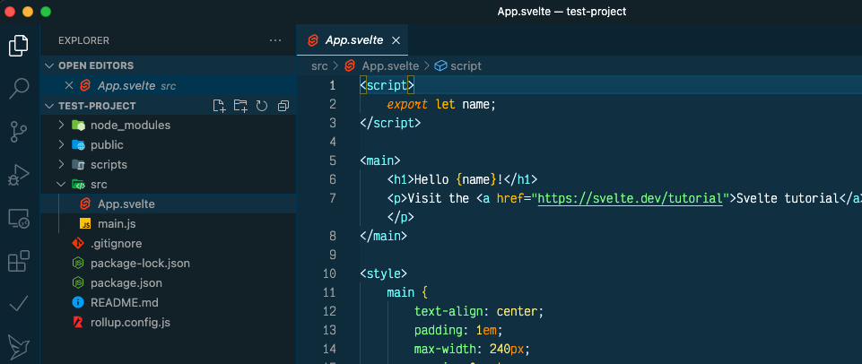
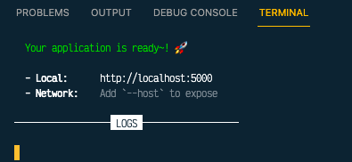

# Svelte for Data Visualisation

This is a non-comprehensive, work in pogress, on using Svelte.js for data visualisation.

**Some assumptions:**

- You have [Node](https://nodejs.org/en/) installed and know the basics of [NPM](https://nodesource.com/blog/an-absolute-beginners-guide-to-using-npm/)
- You have working experience of HTML, CSS and Javascript
- You have some experience of [D3.js](https://d3js.org/)

# Contents

- [Introduction](#introduction)
- [Related documents & sources](#related-docs)

## Introduction 

[Svelte](https://svelte.dev/) is a component library and [SvelteKit](https://kit.svelte.dev/) is an app framework. In practice Svelte can be used to build single-page applications while SvelteKit can be used to build more complex applications. This documentation will focus on Svelte but the principles and practices are mostly applicable to SvelteKit as well.

The primary purpose of this document is to keep a record of learnings and ideas on using Svelte for data visualisation, particularly in conjunction with D3.js and Leaflet.js.

**Note:** This document is a work in progress and will change. The ideas and methods recorded here are not necessarily the best way of doing things, nor are they recommended practices. So treat as suggestions only, and feel free to [contact me](mailto:alastair@mediahack.co.za) with anything you think could or should be improved.

**Some Svelte resources**

- [Svelte site](<(https://svelte.dev/)>)
- [Svelte Tutorial](https://svelte.dev/tutorial/basics)

## Svelte basics

Svelte is different to other frameworks such as React and Vue in that code is compiled to HTML/CSS/Javascript at build and final code doesn't include the Svelte framework. Most other frameworks ship the underlying framework code as well.

From the official Svelte documentation:

> Whereas traditional frameworks like React and Vue do the bulk of their work in the browser, Svelte shifts that work into a compile step that happens when you build your app. - [Svelte.dev](Svelte.dev)

## Setting up for Svelte development

Open your code editor (Visual Studio Code ia recommended). If you're using VS Code you should install the Svelte plugin for better code highlighting: open VS Code extensions in the left-hand bar and look for the Svelte extension. Install that.

## Starting a Svelte project

You will need to have Node (NPM) and NPX installed.

Open a terminal and navigate to where you want your project to be started:

`cd ~/projects for example`

Start a new Svelte project:

`npx degit sveltejs/template my-svelte-project`

_**Note**: You can also use the [MediaHackZA Svelte template](https://github.com/mediahackza/svelte-template) to start a new project. This template was created for internal use but is generic enough to be a useful starter for most projects. The template also includes most of the required packages/tools required for the projects in this guide._

To use the MHC template you can run:

`npm degit mediahackza/svelte-template my-svelte-project`

In both cases above, replace "my-svelte-project" with the name of your project.

Switch into the new directory created:

`cd my-svelte-project`

Then install Svelte and requirements:

`npm install`

## Starting to code

When you open the project in VS Code you will see something similar to this:

The main folders are:

- **node_modules** ignore for now, mainly for node packages
- **public** this has the base index.html file and a global stylesheet (global.css)
- **scripts** ignore for now
- **src** the various components for your project are usually here
- various configuration files

The App.svelte file in src is your starting place. Like all Svelte files it has three pieces: script, html and css. Svelte files aren't required to have all three of these nut most will.

### Scoping

One of the main advantages of Svelte is that css styles are automatically scoped to the component they are in. So, for example, stylesheets in the App.svelte file will only apply to the HTML in App.svelte.

You can add global styles that will apply to the entire app by putting those in global.css in the public folder.

## Running and building code

During development you can start up the development server using:

`npm run dev`

This will start up a server (usually on port 5000) where you can see the code in action as in the example below (ctrl-click/command-click the url to open the server in a browser).

Final code can be built using

`npm run build`

This will build the code in the `public` folder by default

### Client side routing

This document covers Svelte and not SvelteKit. Svelte kit includes it's own file-based router, but Svelte does not. There are many third-party routers that can be used with Svelte. This document will be based on using [Svelte-spa-router](https://github.com/ItalyPaleAle/svelte-spa-router) which is eas to use and suitable for most client-side projects.

_[This video](https://www.youtube.com/watch?v=EL1qM0cv0eA) by Svelte-spa-router creator Alessandro Segala is worth watching for a good introduction to various routing approaches._

## Svelte code starter

### Variables and reactivity

Variables in Svelte can be defined in the script portion and used in the HTML using the curly braces {} For example:

In your script tag:

`let name = "My Name"`

You can then use this variable in your HTML code using curly braces:

`
 Hello {name} 
`

This will output: `Hello My Name`

### Upating variable

In Svelte variables are reactive, so if a variable is changed by some action in the HTML it will automatically update throughout.

For example, we can create a function to change the name value and add an `on:click` event to trigger that.

Setup a 'name' variable and add two buttons to change it and to reset the value:

    

    <main>
        <h1>Hello {name}!</h1>
        <button on:click={changeName}>Change Name</button>
        <button on:click={resetName}>Reset Name</button>
    </main>

We can also change variables directly in the HTML by using a function in the on:click event :

    <button on:click={() => { name = 'Alastair' }}>Reset Name</button>

### Reactivity using $:

Svelte also has a reactivity “watcher” which will monitor variables and immediately run updates when they change.

For example, we can console.log the value of name when it changes. Add this to the script section of the page:

`$: console.log(name)`

If you open the developer tools you’ll see the value of name output each time the button is changed.

## Related documents & sources 

- [Mediahackza Svelte template](https://github.com/mediahackza/svelte-template): a customised template for use with MHC projects but also basic enough to be used as a starter for most projects.
